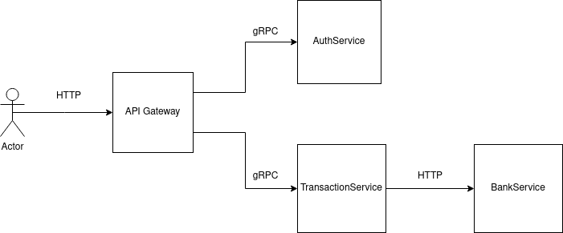
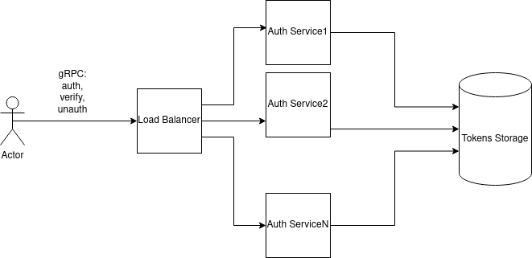
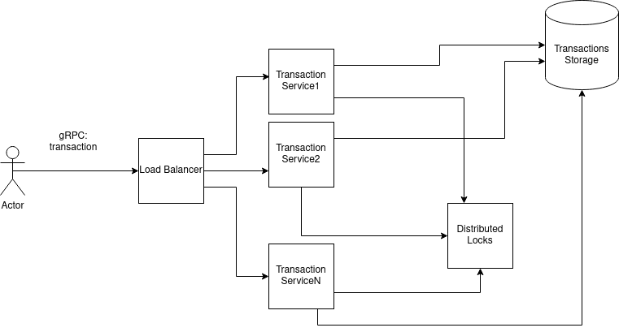
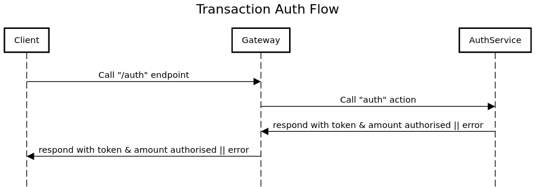
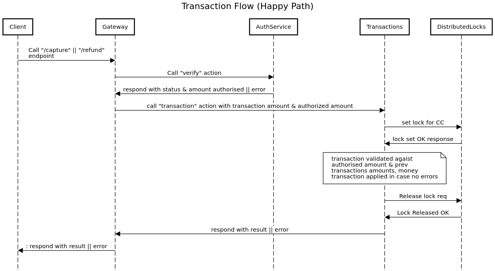

# Payment Gateway

- system based on microservices
- main parts of the system:
  - API gateway to communicate with clients
  - AUTH service
  - Transactions service
  - Bank integration service(s). Here we go with the assumption that these services already exist

## High Level Diagram of the System

## API Gateway

1. API geteway serves all the required endpoint via HTTP
2. API gateway is written in Golang
3. API described with openAPI format
4. *swagger* tool is used to generate server/client code

Please follow the [link](https://github.com/kshamko/boilerplate/tree/master/gateway) to review the code / get more details about the approach 

!!! ADD SWAGGER UI !!!

## Auth Service

1. gRPC is used as communication protocol
2. Auth Service is written in Golang
3. API described with protofile

Please follow the [link](https://github.com/kshamko/boilerplate/tree/master/grpc) to review the code / get more details about the approach 

!!! ADD LINK TO PROTOFILE !!!

### Auth Service Architecture Diagram

## Transactions service

1. gRPC is used as communication protocol
2. Auth Service is written in Golang
3. API described with protofile
4. We need distributed locks system to control concurrent access to particular user's transactions

Please follow the [link](https://github.com/kshamko/boilerplate/tree/master/grpc) to review the code / get more details about the approach 

!!! ADD LINK TO PROTOFILE !!!

### Transactions Service Architecture Diagram

## Sequence Diagrams

### Auth

### Transaction

